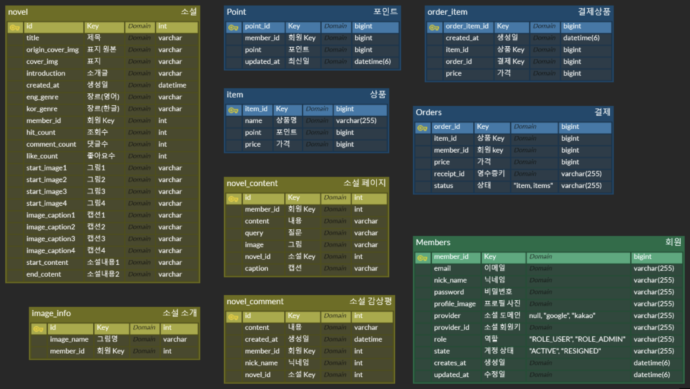
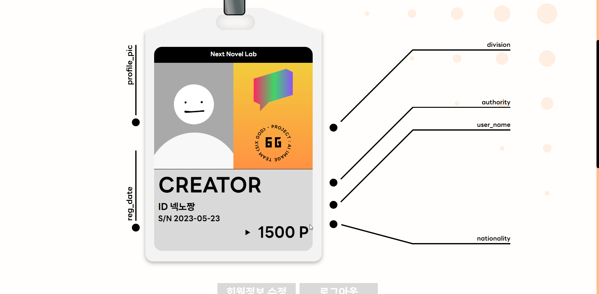

# 🎲 [고도화 프로젝트] [그림이 소설이 되는, Next Novel](https://github.com/ingkoon/Next-Novel)

<br>


## ⌛️ 프로젝트 진행 기간

2023.04.10(월) ~ 2023.05.19(금)<br>
SSAFY 8기 2학기 자율 프로젝트

## 🌞 팀원 소개

### 명규당

명규를 기준으로 프론트, 백엔드 신들이 모인 서울 5반 9조입니다.

- 강은진 - 팀장, BackEnd(회원 서비스)
- 이명규 - BackEnd(소설 서비스), 인프라
- 이인재 - BackEnd(결제 서비스)
- 장지웅 - BackEnd(검색 서비스)
- 소지현 - FrontEnd(반응형 웹 및 기능 구현)
- 서철원 - FrontEnd(반응형 웹 및 )

<br>

## ✨ 프로젝트를 다음과 같이 고도화 하였습니다

- `Django` 프레임워크로 개발된 서비스를 `Spring Boot` 프레임워크로 Migration을 진행하였습니다.
- `MSA (Micro Service Architecture)` 구조로 각 서비스를 독립적으로 개발하였습니다.
- 실운영 서비스만큼의 트래픽을 주고, 성능을 개선하였습니다.
- 코드 중복, AI 처리 지연 감소도 주요 목표로 설정하였습니다.
- 새로운 기능을 추가하였습니다. (결제 시스템, 회원 관리, 유사도 검색 기능)
- 반응형 웹 개발을 통해 다양한 사용환경에 알맞는 UI/UX를 제공하였습니다.
- `TypeScript` 적용을 통해 코드의 안정성과 유지 보수성을 향상시켰습니다.

<br>

## 🏃 Next Novel 의 추가된 기능

### 1) [결제 시스템](https://github.com/ingkoon/Next-Novel/tree/main/backend/service_payment#readme)

- 소설 작성에 필요한 포인트를 결제하는 시스템
- 실 운영시 발생하는 트래픽 문제를 해결하기 위해 도입

### 2) 회원 관리

- `Api Gate Way` 에서 `Spring Security` 및 `JWT 토큰`을 적용한 보안 처리
- 기존의 Kakao 로그인 뿐만 아니라 `Google Oauth2` 로그인 추가

### 3) 유사도 검색 기능

- 소설 내용을 검색하기 위한 기능
- 단순한 문자 검색이 아닌, 단어간의 유사도를 바탕으로 소설을 검색

<br>

##  Spring Cloud MSA (Micro Service Architecture) 적용

### `Django` 서버를  `Spring Cloud` 기반의 `MSA`로 변경하였습니다.

### [고도화 이전, `Django` 서버]
- 소셜 로그인을 통한 회원관리 + 소설 작성 + 소설 CRUD 를 담당하는 Back- end 서버입니다. 
- 모든 기능을 하나의 서버에서 관리하는 `Monolithic Architecture`로 구성되어 있습니다.

### [고도화 이후, `Spring Cloud MSA` 서버]
- `회원(8011)` + `소설(8012)` + `결제(8014~8017)` + `검색(8018)` 총 7개의 서비스로 분할하였습니다.
- 서비스 각각에 대한 엔드포인트는 `APIGateway`에서 리버스 프록시로 접근하게 끔 개발하였습니다.


### 장점
- 각각의 서비스를 독립적으로 개발 할 수 있어 `GitLab` 형상관리, 서비스 의존성, `CI/CD`에서 유용합니다.
- 배포 환경에서 장애 발생시, 모든 기능을 정지하지 않고도 수정이 가능합니다.
- 서비스의 `추가`, `삭제`, `수정` 등의 변경사항이 Monolithic 구조에 비해 용이합니다.

### 단점
- Learning Curve가 큰 편이라 초기 개발 속도 저하가 우려됩니다.
- 분할한 `Micro Service`에 대한 담당자들의 높은 이해가 필수적입니다.

### 개선점
- 현재 결제 서비스만 `Kafka`를 사용한 DB 분할 및 부하 분산 시스템 구축되어 있습니다.
   - 나머지 6개 서비스들도 `Kafka`를 통해 DB접근하는 MQ 기법을 적용하고자 합니다.
- `Kubernetes`를 활용한 무중단 배포 도입 필요합니다
   - `MSA`의 CI/CD 장점인 빠른 빌드로 인해 버전 업데이트가 자주 발생합니다.
   - 잦은 업데이트에도 서비스의 중단 없이 배포하기 위해 `Kubernetes`를 사용하려 합니다.


<br>

## ✔️ 아키텍처 구성도


## ✔️ ERD



## ✔️ 프로젝트 산출물

- [기능 명세서](https://nextnovel2.notion.site/7438d91d81f04798bd534aad00811524?v=3e936ee6afbc4ca8abd98d1d3852d5ba)
- [API 명세서 - 회원, 결제](https://nextnovel2.notion.site/9e2bd3e4fbb744d1ad5bf18dc1e6df6a?v=17131d147e2840b885d3c6dbe2ee21ee)
- [API 명세서 - 소설](https://nextnovel2.notion.site/2314602a137247208b770252cffebc24?v=bfbcd7265e444ce888f5b116e24bda92)
- [ER-Diagram](docs/img/erd.png)

## ✔️ 프로젝트 결과물

- [포팅 메뉴얼](https://nextnovel2.notion.site/b16c15405eb5480c9d5e4e3176b51fa1)
- [중간 발표 자료](docs/서울_5반_A509_중간발표자료.pptx)
- [최종 발표 자료](docs/서울_5반_A509_발표자료.pdf)
- [UCC 영상](docs/자율PJT_서울_5반_A509_UCC경진대회.mp4)

## ✔️ 프로젝트 파일 구조

```markdown
Repository
│
├── backend
│ │
│ ├── api_gateway
│ │ ├── src
│ │ │ ├── ...
│ │ ├── build.gradle
│ │ ├── ...
│ │
│ ├── eureka_server
│ │ ├── src
│ │ │ ├── ...
│ │ ├── build.gradle
│ │ ├── ...
│ │
│ ├── service_ai
│ │ ├── diffusion
│ │ │ ├── diffusion_ControlNet.py
│ │ │ ├── ...
│ │ ├── app.py
│ │ ├── caption.py
│ │ ├── gpt.py
│ │ ├── ...
│ │
│ ├── service_member
│ │ ├── src
│ │ │ ├── ...
│ │ ├── build.gradle
│ │ ├── ...
│ │
│ ├── service_novel
│ │ ├── src
│ │ │ ├── ...
│ │ ├── build.gradle
│ │ ├── ...
│ │
│ ├── service_payment
│ │ ├── core
│ │ │ ├── src
│ │ │ │ ├── ...
│ │ │ ├── ...
│ │ ├── item-service
│ │ │ ├── src
│ │ │ │ ├── ...
│ │ │ ├── ...
│ │ ├── order-item-service
│ │ │ ├── src
│ │ │ │ ├── ...
│ │ │ ├── ...
│ │ ├── order-service
│ │ │ ├── src
│ │ │ │ ├── ...
│ │ │ ├── ...
│ │ ├── point-service
│ │ │ ├── src
│ │ │ │ ├── ...
│ │ │ ├── ...
│ │ ├── build.gradle
│ │ ├── ...
│ │
│ ├── service_search
│ │ ├── app.py
│ │ ├── ...
│ │
│ ├── ...
│
├── frontend
│ │
│ ├── public
│ │ ├── fonts
│ │ │ ├── ...
│ │ ├── game
│ │ │ ├── ...
│ │ ├── icon
│ │ │ ├── ...
│ │ ├── img
│ │ │ ├── ...
│ │ ├── novel
│ │ │ ├── ...
│ │ ├── ...
│ │
│ ├── src
│ │ ├── api
│ │ │ ├── ...│
│ │ ├── components
│ │ │ ├── common
│ │ │ │ ├── ...
│ │ │ ├── game
│ │ │ │ ├── ...
│ │ │ ├── landing
│ │ │ │ ├── ...
│ │ │ ├── library
│ │ │ │ ├── ...
│ │ │ ├── login
│ │ │ │ ├── ...
│ │ │ ├── mypage
│ │ │ │ ├── ...
│ │ │ ├── novelintro
│ │ │ │ ├── ...
│ │ │ ├── novelread
│ │ │ │ ├── ...
│ │ │ ├── novelwrite
│ │ │ │ ├── ...
│ │ │ ├── payment
│ │ │ │ ├── ...
│ │ │ ├── search
│ │ │ │ ├── ...
│ │ ├── context
│ │ │ ├── ...
│ │ ├── hooks
│ │ │ ├── ...
│ │ ├── pages
│ │ │ ├── ...
│ │ ├── types
│ │ │ ├── ...
│ │ ├── App.css
│ │ ├── App.tsx
│ │ ├── App.test.tsx
│ │ ├── index.css
│ │ ├── index.tsx
│ │ ├── react-app-env.d.ts
│ │ ├── reportWebVitals.ts
│ │ ├── setupTests.ts
│ │
│ ├── ...
│
├── docs
│ ├── img
│ │ ├── ...
│ ├── ...
│
├── exec
│ │
│ ├── 포팅매뉴얼.md
│
├── README.md
├── ...
```

<br>

## 🎲 Next Novel 서비스 화면

### 랜딩


### 회원가입


### 로그인


### 카카오 로그인


### 구글 로그인


### 내정보보기


### 내정보수정


### 소설목록


### 소설검색


### 소설인트로


### 소설읽기


### 소설감상평작성


### 소설작성1


### 소설작성2


### 소설작성3


### 소설작성4


### 소설작성5


### 소설작성6


### 소설작성7


### 소설작성8


### 소설작성9


### 결제시스템



<hr>
