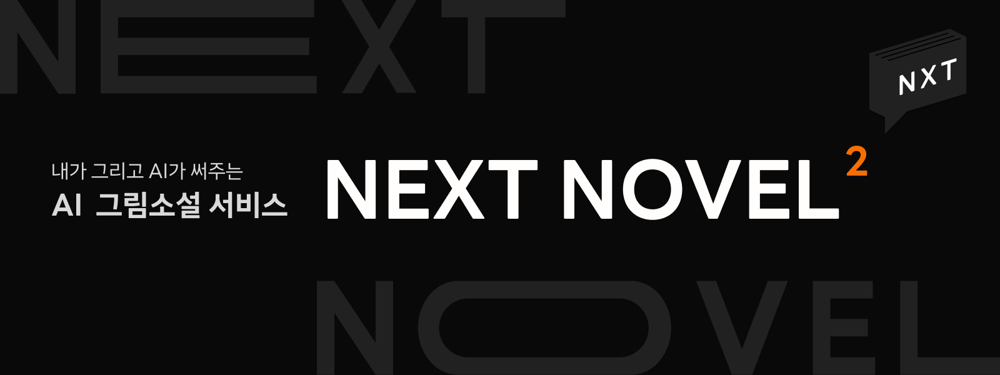
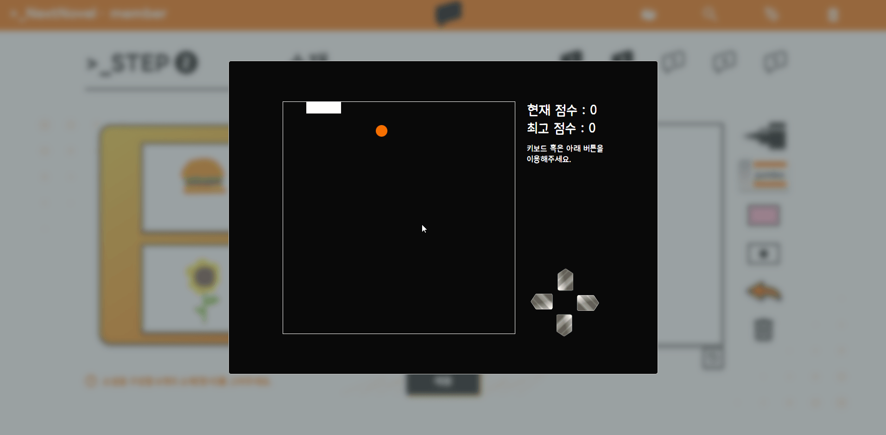

# 🎲 그림이 소설이 되는, Next Novel


## ⌛️ 프로젝트 진행 기간
2023.02.27(월) ~ 2023.04.07(금) (40일간 진행)<br>
SSAFY 8기 2학기 특화 프로젝트

## ✨ Next Novel 서비스 개요
### 기획 배경
- AI 생성 모델 중 GPT 를 활용한 서비스 개발
- 인공지능 영상 도메인으로써 그림을 활용

## 🏃 Next Novel 의 이용 목적
- 그림만으로 간단하게 소설을 작성할 수 있습니다.
- AI의 상상력을 빌려 생각치도 못한 소설을 볼 수 있습니다.
- 친구들과 그림 실력을 뽐내며 서비스를 즐길 수 있습니다.

## 🌞 팀원 소개
### Six God
프론트, 백엔드, AI 신 여섯이 모인 서울 5반 2조

- 이정범 - 팀장, BackEnd, 배포
- 김수빈 - FrontEnd
- 소지현 - FrontEnd
- 서철원 - FrontEnd
- 이명규 - AI, 서버, 배포
- 강은진 - AI, 배포

## ✔️ 아키텍처 구성도


## ✔️ 주요 기능
### 1) 내가 그린 그림을 바탕으로 소설 작성
- 원하는 장르(로맨스, 판타지, 추리, SF, 자유)를 선택
- Image Captioning을 통해 그림을 캡셔닝해 소재 추출
- ChatGPT를 통해 소설 생성
- 사용자가 원한다면 소설을 이어가기 위한 질문 생성 후에 위 2-3번을 반복

### 2) 소설 표지 및 세부사항 작성
- 소설 표지를 그림으로 그리면 Stable Diffusion을 이용하여 표지 생성
- 맘에 들지 않을 경우, 계속하여 생성 가능
- 사용자가 직접 제목, 한마디 요약을 작성

### 3) 소설 생성시 지루함을 이겨내기 위한 미니게임
- 소설 생성시 기다리는 시간에 지루함을 느낄 수 있음
- 이를 위한 빠른 템포의 '스네이크 게임'을 추가
- LocalStorage에 자신의 최고 점수도 저장하여 승부욕 증가
- 바닐라 JS를 이용하여 구현

### 4) 도서관 및 검색 기능
- 다른 사용자가 제작한 소설을 열람하고, 한줄평 작성 가능
- 소설의 제목 혹은 소설 작성자를 기반으로 keyword 검색 가능
- 장르별 정렬로 자신이 관심있는 분야의 소설 확인 가능

### 5) MZ스러운 디자인과 친절한 이용 가이드
- GSAP 애니메이션 효과와 주황빛 컬러
- 사용자를 위한 이용가이드 페이지 제공
  

## ✔️ 주요 기술
### 1) ChatGPT API
- OpenAI 의 ChatGPT API 를 활용하여 소설(이야기)을 생성합니다.
- 영어를 한글로 번역하여 화면에 보여줍니다.

### 2) Image Captioning
- 이미지를 설명하는 문장 추출
- [CoCa : Contrastive Captioners](https://huggingface.co/spaces/laion/CoCa) 모델을 사용하였습니다.
- CoCa는 Vision&Language 계열의 논문에서 여러 task를 해결하기 위해 제안되었던 여러가지 모델 구조를 하나의 구조로 통합한 모델

### 3) Stable Diffusion
- Image to Image 생성 모델
- 표지 그림을 그리면 더 생동감 있는 그림으로 변환합니다.
- [ControlNet 의 Canny Edge 를 이용한 Stable Diffusion](https://colab.research.google.com/drive/19rp4QUjAlf0L7UOOeE6eZCjnbUpq6duf?usp=sharing) 모델을 사용하였습니다.
- ControlNet 은 추가 조건을 추가하여 확산 모델을 제어하는 신경망 구조입니다.
- Canny Edge 는 윤곽을 가장 잘 찾아내는 에지 찾기 알고리즘 입니다.

### 4) 캔버스 페인팅
- Canvas 태그와 바닐라 자바스크립트를 이용하여 구현하였습니다.
- 다양한 색과 펜 크기로 캔버스에 그림을 그릴 수 있습니다.
- 지우개, 뒤로가기, 삭제 기능을 추가로 제공합니다.
- 마우스 클릭 이벤트와 터치 이벤트로 페인팅할 수 있으며, 웹 및 태블릿 환경에서 즐길 수 있습니다.
- 제출한 그림들은 저장하였고 이를 재사용할 수 있습니다.

## ✔️ 프로젝트 파일 구조
```
Repository
 │
 ├── AI-Server
 │     │
 │     ├── diffusion
 │     │     ├── diffusion_ControlNet.py
 │     │
 │     ├── README.md
 │     ├── app.py
 │     ├── caption.py
 │     ├── gpt.py
 │     ├── output.txt
 │     ├── requirements.txt
 │     ├── tmp.py
 │     ├── www.py
 │
 │ 
 ├── Next-Novel
 │     │
 │     ├── public
 │     │      ├── fonts
 │     │      │    ├── ...
 │     │      │
 │     │      ├── game
 │     │      │    ├── ...
 │     │      │
 │     │      ├── icon
 │     │      │    ├── ...
 │     │      │
 │     │      ├── img
 │     │      │    ├── ...
 │     │      │
 │     │      ├── ...
 │     │
 │     ├── src
 │     │       ├── api
 │     │       │       ├── ...
 │     │       │
 │     │       ├── components
 │     │       │       ├── common
 │     │       │       │      ├── ...
 │     │       │       │
 │     │       │       ├── game
 │     │       │       │      ├── ...
 │     │       │       │
 │     │       │       ├── landing
 │     │       │       │      ├── ...
 │     │       │       │
 │     │       │       ├── library
 │     │       │       │      ├── ...
 │     │       │       │
 │     │       │       ├── login
 │     │       │       │      ├── ...
 │     │       │       │
 │     │       │       ├── mypage
 │     │       │       │      ├── ...
 │     │       │       │
 │     │       │       ├── novelintro
 │     │       │       │      ├── ...
 │     │       │       │
 │     │       │       ├── novelread
 │     │       │       │      ├── ...
 │     │       │       │
 │     │       │       ├── novelwrite
 │     │       │       │      ├── ...
 │     │       │       │
 │     │       │       ├── search
 │     │       │       │      ├── ...
 │     │       │
 │     │       ├── context
 │     │       │       ├── ...
 │     │       │
 │     │       ├── hooks
 │     │       │       ├── ...
 │     │       │
 │     │       ├── module
 │     │       │       ├── ...
 │     │       │
 │     │       ├── pages
 │     │       │       ├── ...
 │     │       │
 │     │       ├── App.css
 │     │       ├── App.js
 │     │       ├── App.test.js
 │     │       ├── index.css
 │     │       ├── index.js
 │     │       ├── mobile.module.css
 │     │       ├── reportWebVitals.js
 │     │       ├── setupTests.js
 │     │
 │     ├── README.md
 │     ├── ...
 │
 │
 ├── backend
 │     │
 │     ├── app
 │     │    ├── ...
 │     │
 │     ├── nextnovel
 │     │    ├── ...
 │     │
 │     ├── nginx
 │     │    ├── ...
 │     │
 │     ├── novels
 │     │    ├── ...
 │     │
 │     ├── redis
 │     │    ├── ...
 │     │
 │     ├── users
 │     │    ├── ...
 │
 │
 ├── docs
 │     │
 │     ├── img
 │     │    ├── ...
 │     │
 │     ├── ...
 │
 │
 ├── exec
 │     │
 │     ├── 포팅매뉴얼.md
 │
 ├── README.md
 ├── ...
``` 


## ✔️ 협업 툴
- GitLab
- Notion
- Figma
- JIRA
- MatterMost
- Webex

## ✔️ 협업 환경
- GitLab
    - 코드의 버전 관리
    - 개발 이슈 관리 및 해결을 위한 회의
    - MR과 팀원의 코드리뷰
- Notion
    - 기획 단계에서 도출된 아이디어 정리
    - 회의록과 팀미팅을 기록하여 의견과 해결사항을 정리
    - 팀 그라운드 룰을 정리
    - Jira 일정 계획 수립
    - Git Commit 컨벤션 정리
    - 참고자료 정리
    - Back-end, Front-end, AI 별 개발 이슈 정리
    - API 상태 코드 정리
- Figma
    - UI/UX에 초점을 둔 실시간 협업
    - Next Novel 만의 디자인과 메인 컬러 지정
    - 애니메이션, gif 이미지 활용
    - 목업과 와이어프레임 정리
- Jira
    - 일주일 단위로 프로젝트 일정 관리
    - 23.02.27 ~ 23.04.07 기간의 일정 관리
    - 기획, 설계, 개발, 정기 회의, 내부 행사, 개인 공부, 발표

## ✔️ 프로젝트 산출물
- [기능 명세서](https://chipped-cart-851.notion.site/a96e0e004e4c4f39bab65fa821f4825f?v=f77e4329cc5e4b4fbb3a73894ba13c8c)
- [API 명세서](https://chipped-cart-851.notion.site/838d5959ec264671ac3dc8410c0983fa?v=56e9cb334ec14ee4a3634693dba9cced)
- [와이어 프레임](docs/img/wireframe.png)
- [ER-Diagram](docs/img/erd.png)

## ✔️ 프로젝트 결과물
- [포팅 메뉴얼](https://lab.ssafy.com/s08-ai-image-sub2/S08P22A502/-/blob/main/exec/%ED%8F%AC%ED%8C%85%EB%A7%A4%EB%89%B4%EC%96%BC.md)
- [중간 발표 자료](docs/서울_5반_A502_중간발표자료.pptx)
- [최종 발표 자료](docs/서울_5반_A502_최종발표자료.pptx)
- [UCC 영상](docs/특화PJT_서울_5반_A502_UCC경진대회.mp4)

## 🎲 Next Novel 서비스 화면
### 랜딩

### 로그인

### 내정보보기

### 내정보수정

### 소설목록

### 소설검색

### 소설인트로

### 소설읽기

### 소설감상평작성

### 소설작성1

### 소설작성2

### 소설작성3

### 소설작성4

### 소설작성5

### 소설작성6

### 소설작성7

### 소설작성8

### 소설작성9


<hr>
