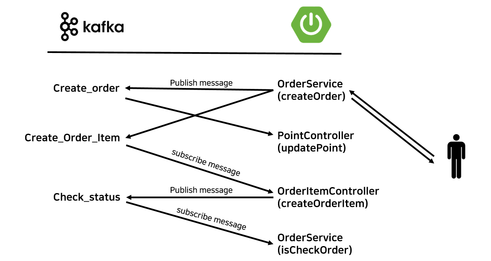

# NextNovel 결제 시스템
---
## 목차

1.[기술 스택](#1.-기술-스택)

2.[결제 수행 로직](#2.-결제-수행-로직)

3.[프로젝트 구조](#3.-프로젝트-구조)

## 1. 기술 스택

---


### Spring Boot
웹 서버를 구현하기 위한 프레임워크로 MSA 구현을 위한 Spring cloud와 </br>
데이터베이스 접근 기술로 ORM 방식의 영속 데이터관리가 가능한 JPA(Java Persistence API)를 사용하였습니다.

### Apache Kafka
도메인간의 데이터 송/수신을 위한 Message Queue로 선택한 이벤트 스트리밍 플랫폼입니다.
Java에서 사용가능한 라이브러리를 import하여 결제 과정을 구현하였습니다.

### bootpay
결제요청을 위한 PG 플랫폼입니다. 해당 플랫폼에서 제공하는 API를 활용하여
결제 정보를 생성,삭제 등의 과정을 수행합니다.

### MySQL
결제 정보, 상품, 주문 상품, 사용자 포인트의 관리를 위해 사용하는 데이터베이스입니다.

## 2.결제 수행 로직

---



1. 사용자가 요청을 수행합니다.
2. Order-Service 프로젝트에서 bootpay를 통한 결제정보 검증 및 DB에 들어갈 데이터 생성을 수행합니다. 
이후 Point-service와 OrderItem-service와 연결된 토픽에 메시지를 전달합니다. 
3. Point-service에서 전달받은 정보를 바탕으로 사용자의 충전된 값을 갱신합니다.
4. OrderItem-service에서 전달받은 정보를 바탕으로 사용자의 주문과 상품 정보를 저장합니다. 정상적으로 저장되었을 경우, 다시 Order-service에 정상적으로 저장되었음을 보냅니다.
5. Order-service는 상태관련 정보를 받아와 주문의 상태를 성공으로 바꿉니다.

## 3. 프로젝트 구조

---

MSA 기반의 프로젝트를 구상했기 때문에 이를 위해 기존의 모놀리식 프로젝트를 
멀티모듈 구조로 프로젝트를 재구성했습니다.

```
PaymentsService
├─core
│  └─src
│      ├─main
│      │  ├─generated
│      │  ├─java
│      │  │  └─com
│      │  │      └─a509
│      │  │          └─common
│      │  │              ├─bootpay
│      │  │              │  ├─dto
│      │  │              │  └─exception
│      │  │              ├─dto
│      │  │              │  ├─order
│      │  │              │  │  ├─request
│      │  │              │  │  └─response
│      │  │              │  ├─orderitem
│      │  │              │  │  ├─request
│      │  │              │  │  └─response
│      │  │              │  └─point
│      │  │              │      ├─request
│      │  │              │      └─response
│      │  │              ├─dummy
│      │  │              ├─enums
│      │  │              └─exception
│      │  │                  ├─dto
│      │  │                  ├─enums
│      │  │                  ├─item
│      │  │                  ├─order
│      │  │                  ├─orderitem
│      │  │                  └─point
│      │  └─resources
│      └─test
│          ├─java
│          └─resources
├─item-service
│  └─src
│      ├─main
│      │  ├─generated
│      │  ├─java
│      │  │  ├─com
│      │  │  │  └─a509
│      │  │  │      ├─controller
│      │  │  │      ├─domain
│      │  │  │      ├─dto
│      │  │  │      ├─dummy
│      │  │  │      ├─enums
│      │  │  │      ├─repostiory
│      │  │  │      └─service
│      │  │  └─org
│      │  └─resources
│      └─test
│          ├─java
│          └─resources
├─order-item-service
│  └─src
│      ├─main
│      │  ├─generated
│      │  ├─java
│      │  │  └─com
│      │  │      └─a509
│      │  │          ├─config
│      │  │          ├─controller
│      │  │          ├─domain
│      │  │          ├─dto
│      │  │          │  ├─request
│      │  │          │  └─response
│      │  │          ├─repository
│      │  │          └─service
│      │  └─resources
│      └─test
│          ├─java
│          └─resources
├─order-service
│  └─src
│      ├─main
│      │  ├─generated
│      │  ├─java
│      │  │  └─com
│      │  │      └─a509
│      │  │          ├─common
│      │  │          │  ├─dummy
│      │  │          │  └─kafka
│      │  │          │      ├─config
│      │  │          │      └─deserializer
│      │  │          ├─controller
│      │  │          ├─domain
│      │  │          ├─dto
│      │  │          │  └─response
│      │  │          ├─repository
│      │  │          └─service
│      │  └─resources
│      └─test
│          ├─java
│          └─resources
└─point-service
    └─src
        ├─main
        │  ├─generated
        │  ├─java
        │  │  └─com
        │  │      └─a509
        │  │          ├─config
        │  │          ├─controller
        │  │          ├─domain
        │  │          │  └─dto
        │  │          │      ├─request
        │  │          │      └─response
        │  │          ├─repository
        │  │          └─service
        │  └─resources
        └─test
            ├─java
            └─resources

``` 

